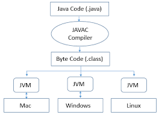
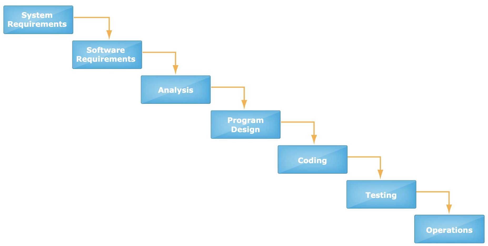
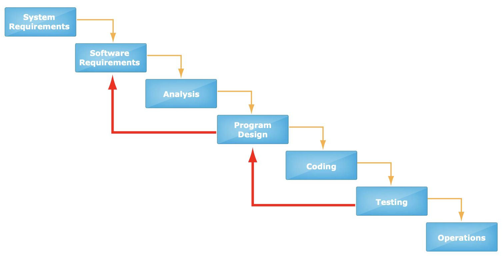
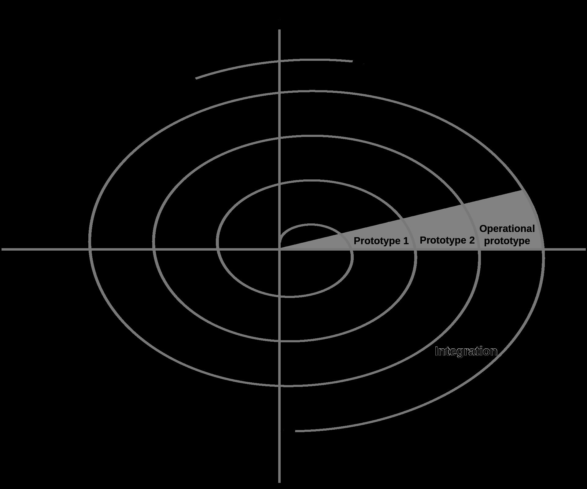
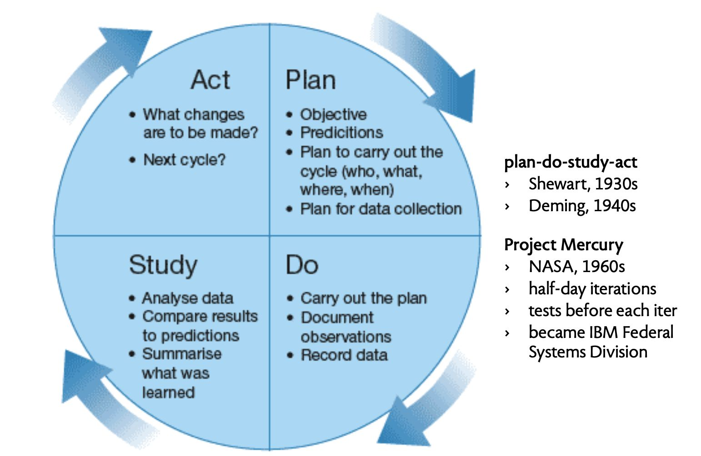
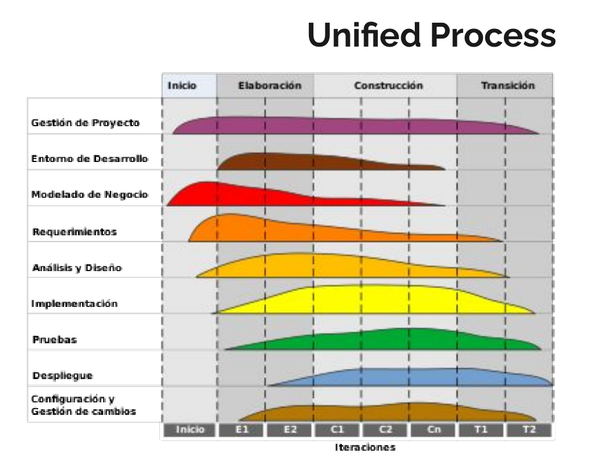
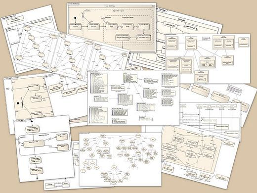
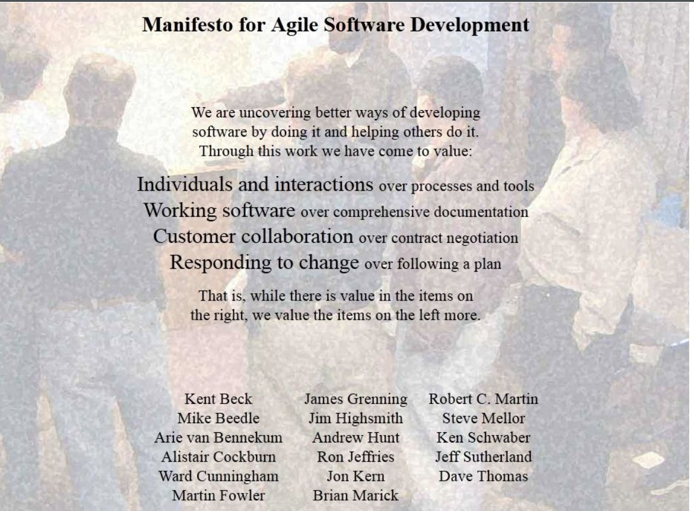

# Clase 14 de Marzo

Es mejor tener menor dependencia de otras clases, para que nuestro código no dependa de los cambios de otras clases que no son la nuestra.

## Respecto a Ruby
### ¿Soporta herencia múltiple?
No. Aun si lo soportara, no es recomendable tener herencia múltiple

## Repaso de la primera clase
### Los principales desafios del desarrollo de Software
Tiempo, extensibilidad y presupuesto
- Cumplir con los plazos
- Calidad, o que no haya bugs
- Estimar costo de mantención
- El Software se tiene que adaptar
- Debe ser seguro
- Debe ser portable

### ¿Cuál es el problema?
- A menudo el Software no hace lo que el usuario quiere
- Caro
- No es suficientemente rápido
- Dificil de usar
- No puede ser portado
- Es muy caro de mantener
- Es poco confiable
- Hay muchos proyectos de Software que se atrasan

Fun fact: Java resolvió un poco el problema de la portabilidad, por medio de la creación de una máquina virtual que era compatible independiente del sistema operativo, por lo que el programa se compila una sola vez, y es compatible con cualquier sistema que sea compatible con Java
</img>
One of the planning documents for software research revealed --in a parenthetical remark only-- an unchallenged tacit assumption by referring to "the tradeoff between cost and quality". Now in all sorts of mechnical engineering it may make sense to talk about "the tradeoff between cost and quality", in software development this is absolute nonsense, because poor quality is the major contributor to the soaring costs of software development.

Dijkstra

### Proceso de Desarrollo
Corresponde a la estrategia usada para llegar al producto final.
Este es el "The Waterfall Model (1970)" o el modelo en cascada
### Modelo en Cascada (1970)
</img>
Se caracteriza en ser una secuencia lineal de actividades una detras de la otra
La principal ventaja es que es facil de entender
Desventajas:
- Se dilata demasiado la reducción de riesgo
- Muy dificil incorporar cambios en los requisitos

Dentro de todo, es recomendable en proyectos cortos
Vale la pena destacar que en la practica lo que ocurre es esto:
</img>

### Modelo del Espiral (Spiral Model, 1986)
</img>
Origins of iterative approaches
</img>

### Modelo Unificado
</img>

### Unified Model Language
</img>
Ayno que complicado >~<
Fun fact: La gente dentro de la ingeniería de software tienen muchas opiniones y se aferran un montón a ellas XD

### Extreme Programming (XP)
- Kent Beck, 1999
    - Take bests practices to the "extreme" levels
    - Developed during C3 project with Ron Jeffries

- A sample of XP practices
    - Test first: Acceptance and unit tests
    - Continuous integration (Integración continua)
    - Pair programming (Programación con pares)
    - Repeated refactoring

- Chrysler's C3 payroll system
    - Started in 1996, cancelled in 2000
    - Implemented in Smalltalk
    - Running payroll took 1000 hours initially
    - Chrysler said they abandoned XP after this

</img>

Pero... ¿Qué es "Agile"?
Iterativo e incremental: Dar más valor a...
- Individuos e interacciones que a procesos y herramientas
- Software funcional que la documentación comprensiva
- Colaboración con el cliente que la negociación del contrato
- Respuesta al cambio que seguir el plan

1. Our highest priority is to satisfy the customer through early and continuous delivery of valuable software.
2. Welcome changing requirements, even late in development. Agile processes harness change for the customer’s competitive advantage.
3. Deliver working software frequently, from a couple of weeks to a couple of months, with a preference to the shorter timescale.
4. Business people and developers must work together daily throughout the project.
5. Build projects around motivated individuals. Give them the environment and support they need, and trust them to get the job done.
6. The most efficient and effective method of conveying information to and within a development team is face-to-face conversation.
7. Working software is the primary measure of progress.
8. Agile processes promote sustainable development. The sponsors, developers, and users should be able to maintain a constant pace indefinitely.
9. Continuous attention to technical excellence and good design enhances agility.
10. Simplicity – the art of maximizing the amount of work not done – is essential.
11. The best architectures, requirements, and designs emerge from self-organizing teams.
12. At regular intervals, the team reflects on how to become more effective, then tunes and adjusts its behavior accordingly.

Cuento corto: Agile es un set de valores y principios

### Practicas de Extreme Programming (XP)
Entre las más comunes podemos encontrar:
- Pair Programming
- **Test Driven Development**
- Continuous Integration
- **Code Refactorings**
- Small releases
- On site costumer

## Para la siguiente clase...
Veremos Scrum y Kanban
El miercoles vamos a aplicar Ruby en Web