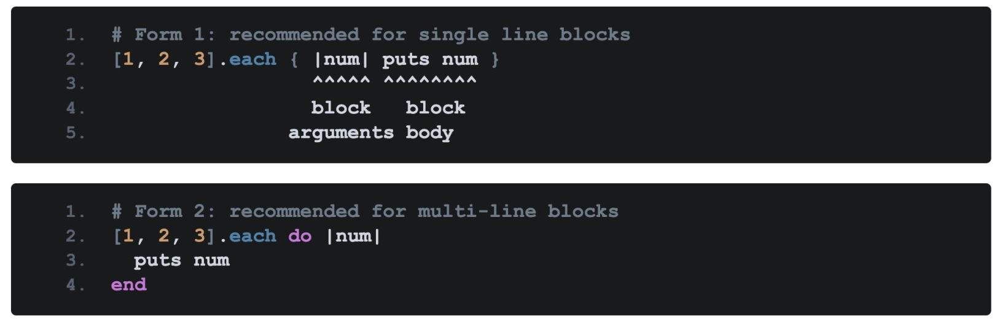
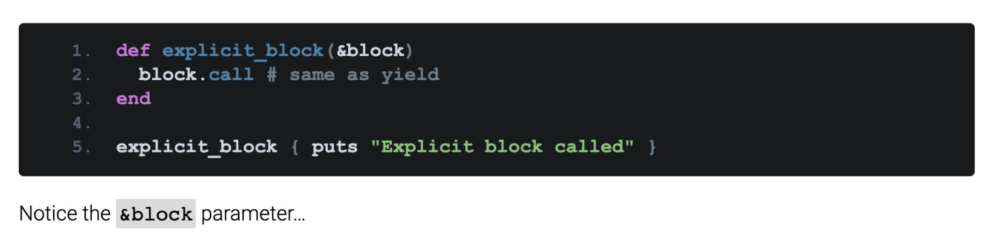
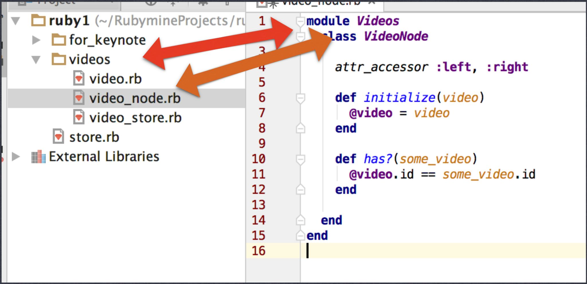
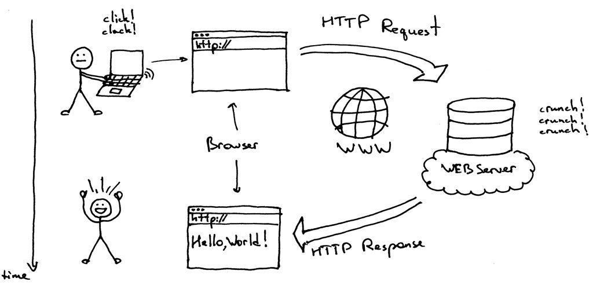
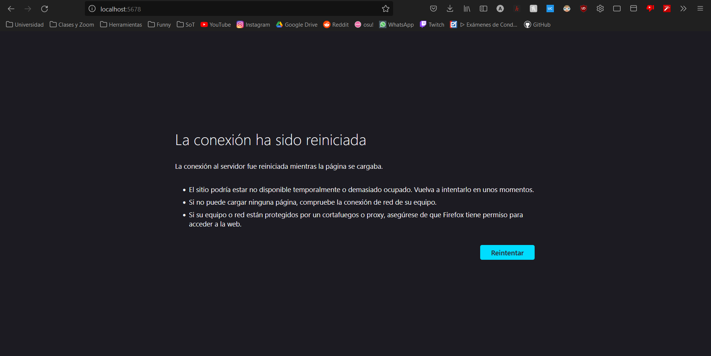
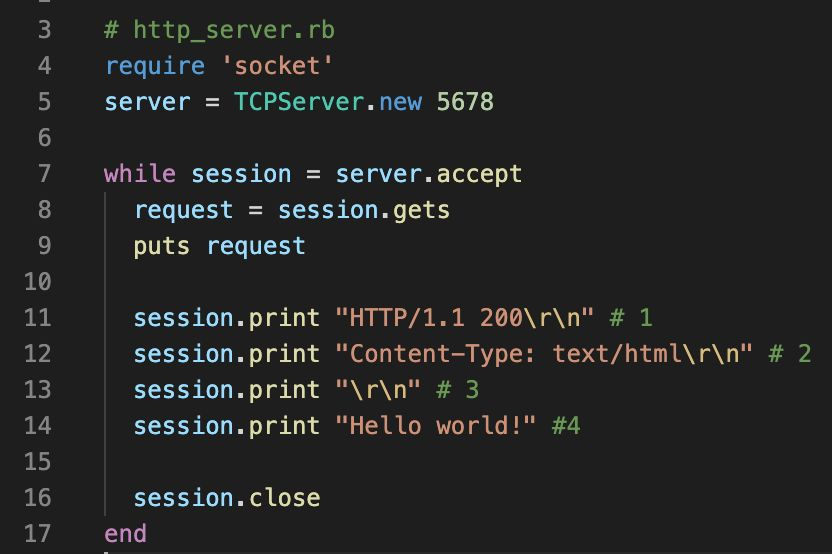

# Clase 16 de Marzo

## Cosas inusuales de Ruby
#### Bloques
No existe el "return" como en Python, sino que simplemente se retorna la ultima linea del bloque de código
</img>
</img>

#### Symbol vs String
El simbolo es inmutable, mientras que un string si.
Hay diferencias de memoria, pero no cache bien jajasjdkask

## Estructuras de datos utiles
#### Arreglos (Array)
```ruby
an_array = Array.new

an_array.push 2
an_array.push 7
an_array.push 1
an_array.push 4

puts an_array.inspect
#Imprime [2,7,1,4]

#Otra forma
an_array = [2,7,1,4]
puts an_array.inspect
```
#### Rango
Pendiente escribir despues

#### Hashes
```ruby
dictionary = {"one" => "eins", "two" => "zwei", "three" => "drei"}
puts dictionary["one"]

dictionary["zero"] = "null"
puts dictionary ["zero"] #Printea "null"
```

#### Hash Keys
Pendiente escribir despues

#### Hash Methods
Escribir despues

## Archivos


## Web


00110010 00110000 00110010 0011

Esto significa `"2022"` en string
Sin embargo, la computadora B piensa que esta recibiendo un numero en lugar de un string, e interpreta el mensaje como el número decimal 18537. Para que esto no ocurra, necesitamos un **protocolo**

### Creemos un server en Ruby (Servidor Hello World!)
`server`
```ruby
require 'socket'
server = TCPServer.new 5678

while session = server.accept
    session.puts "Hello World"
    session.close
end

```

`cliente`
```ruby
require 'socket'
server = TCPSocket.new 'localhost', 5678

while line = server.gets
    puts line
end

server.close
```

Si un cliente web se intenta conectar al servidor...
</img>


Todo lo que hicimos aquí, fue enviar a nuestro servidor la información del protocolo HTTP, lo que permite armar una página web en el momento.

Esto igual es un poco complicado...
Para esto tenemos Rails! Este paquete de gemas hace toda la pega que estabamos haciendo de forma manual

