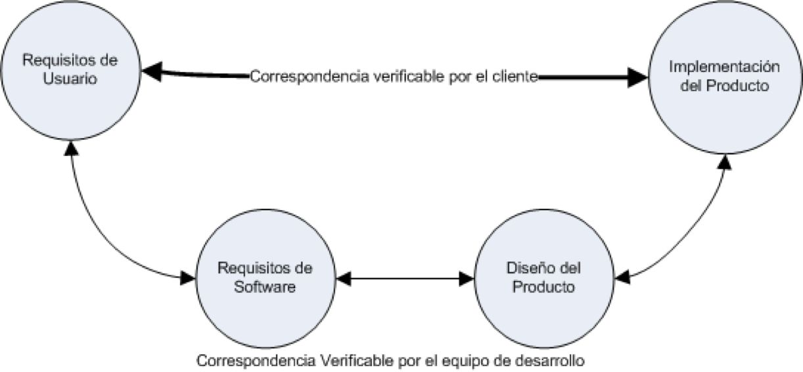
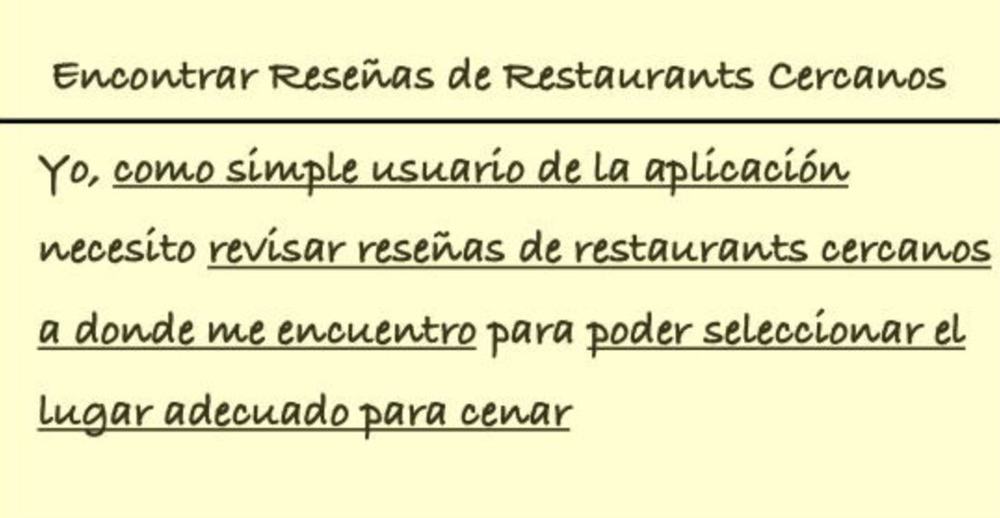
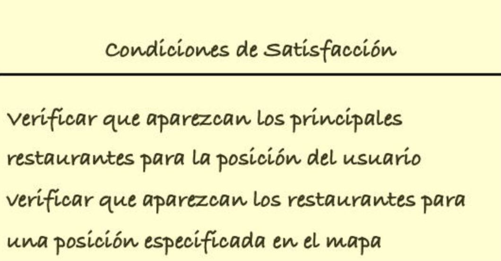
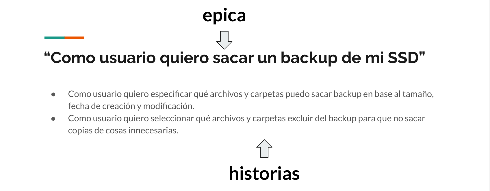
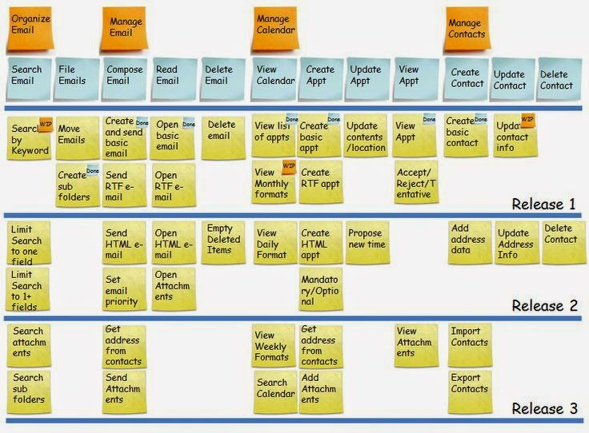

# Clase 28 de Marzo

## Repaso de Scrum
- Product Owner: La persona más cercana a el cliente. Es responsable del éxito y el fracaso del proyecto, y de generar la comunicación entre el cliente y el equipo de desarrolladores.
- Product Backlog: Pilas de historias de Usuario.
- Sprint Backlog: Pilas de tareas.
- Scrum Master: Encargado de la convivencia del equipo y de que se cumplan todas las metas que propone el Scrum.

## Historias de Usuario
### Requisitos
Un requisito es una capacidad, característica o factor de calidad que un sistema necesita para tener valor y utilidad para el usuario.
El objetivo claro de la Ingeniería de Software es usar un enfoque sistemático para encontrar, documentar, organizar y monitorear requisitos **cambiantes** de un sistema.
Tradicionalmente, se clasifican en:
- Funcionales: Funciones o características que describen el quehacer del sistema.
- Reglas de Dominio: Restricciones generales del campo de aplicación o negocio: políticas, normativas, etc...
- No funcionales: Atributos de calidad del sistema.

## Documento de Requerimientos
</img>
Revisemos una plantilla, basada en la propuesta de Tom Glib *(Glib, 1988)*
- **ID**: RC25
- **NOMBRE**: Consistencia
- **ESCALA**: Probabilidad de que dos mediciones básicas sean consistentes.
- **PRUEBA**: 1000 mediciones básicas commparadas usando 3 cifras significativas.
- **ACTUAL**: Entre 90% y 95%.
- **PEOR ACEPTABLE**: 98%.
- **PLANIFICADO**: 99.5%
- **AUTORIDAD**: minuta del 20/08/2010.
¡OJO! ESTE FORMATO YA NO SE UTILIZA XDDDDD
El proposito del documento de requisitos es refinar una idea para para definir correctamente que es lo que se espera del sistema computacional. Anteriormente, los analistas eran los responsables de crear este documento.

### Entregable
Servía de contrato entre usuarios y desarrolladores
**Problemas**
- Es imposible ...

## Historias de Usuario
### ¿Qué es una historia de usuario?
Técnica de captura de requisitos centrado en el uso / usuario.
- Descripción de requisitos basada en objetivos del usuario y la interacción de los usuarios con el sistema para el logro de dichos objetivos.

### Formato anverso
- Título: El titulo debe comenzar con un verbo y debe describir en forma muy clara el objetivo.
- Descripción: Yo, como *tipo de usuario* necesito *ejecutar alguna tarea* para *alcanzar un objetivo*.
</img>

### Formato reverso
- Condiciones de satisfacción: Puede verse como tests de validación de la prestación, pero suelen servir adenás para entregar valiosa información adicional al desarrollador.
</img>

## Historias de Usuario: Granularidad
Se pueden establecer diversos niveles de abstracción
- Epics: Grandes historias de usuario que suelen abarcar meses de desarrollo. Estas normalmente se refinan progresivamente en historias de usuario más pequeñas.
- Historias: Historias de tamaño adecuadas como para implementarlas en un sprint.
- Theme: Contenedor de historias relacionadas.

Ejemplo:
</img>

### Scrum Product Backlog
</img>
(a paint no le gustan los pngs transparentes :c)

## INVEST - Un criterio de calidad
- Independent: Independientes entre si, o débilmente relacionadas.
- Negotiable: No es un contrato ni una especificación sino una referencia a una característica que el equipo debe discutir.
- Valuable: Debe propocionar valor al usuario.
- Estimatable: Debe tener suficiente detalle para poder estimar el costo/tiempo de desarrollo.
- Small: Debe caber en un sprint.
- Testeable: Deben ser comprobables mientras pruebas.

## Elaboración de las Historias
Hablando con los usuarios se van armando progresivamente las historias.
- Un enfoque adecuado es la organización de WORKSHOP de especificación conjunta que involucre a usuarios y skateholders.
- User Story Writing Workshop
    - Identificación de roles de usuario y un conjunto de historias de usuarios candidatas para la antrega del primer producto.
    - Se puede reemplazar por epics y luego ir refinando en historias de usuario.
- Story mapping
    - Técnica de refinamiento y ordenación temporal de historias de usuario.
    - Propociona una lista priorizada del backlog.

