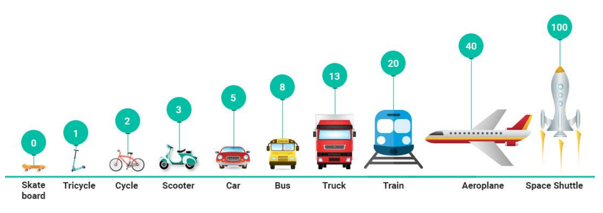
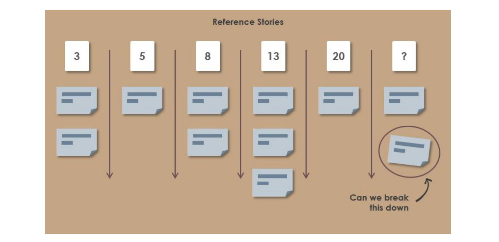
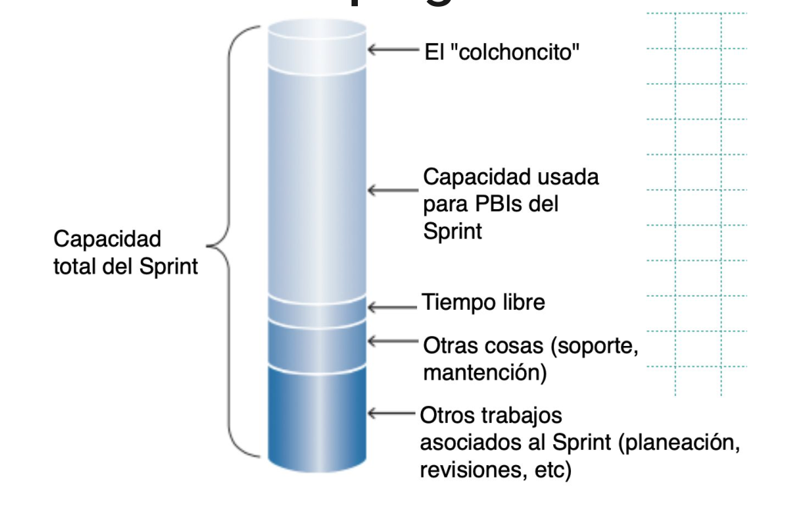
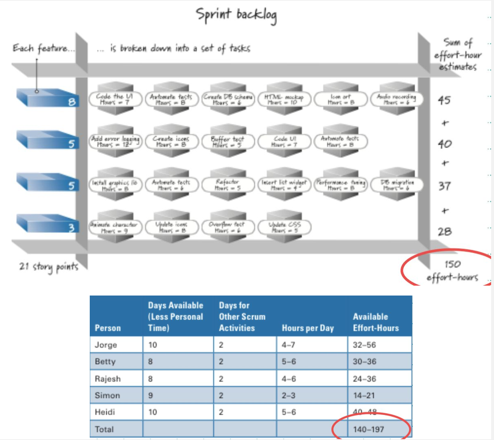
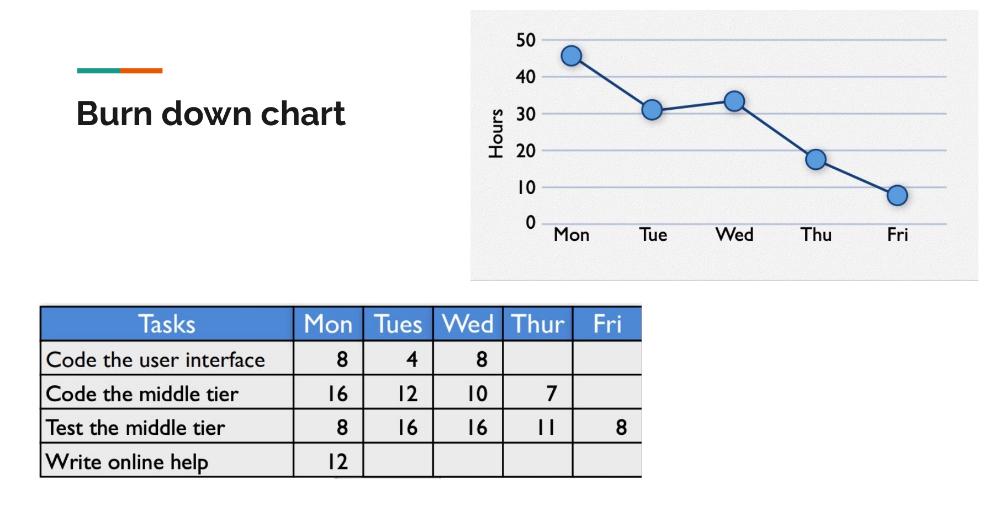

# Clase 4 de Abril

## PENDIENTE! VER EL VIDEO DE CRUD QUE SUBIO EL PROFESOR
Está disponible en el Canvas del curso.

## Planificación
### ¿Que significa planeación en el contexto ágil?
Ser ágil no significa no tener un plan. Significa que el plan tiene la habilidad de ir siendo adaptado.

## Niveles de Planeación
- El nivel de Sprint (Lo que ira en la siguiente entrega)
- El nivel de Release

## La necesidad de ajustar
- La agilidad implica abrazar al cambio.
- Las estimaciones tempranas suelen no ser muy certeras
- A medida que el proyecto avanza tenemos más elementos para mejorar las estimaciones iniciales. Puede ser necesario ajustar
- El plan del sprint *no se ajusta*. El ajuste puede ocurrir una vez terminando el sprint y sobre todo luego del sprint review y el sprint retrospective

- Ajuste por tiempo: Ir avergonzadamente a negociar más tiempo.
- Ajuste por alcance: Se entrega en el deadline pactado pero se negocia en cuanto a funcionalidades del release (alcance del producto)
- La calidad no se negocia, un producto de mala calidad en realidad termina costando más caro a la larga.

# Planificación (Release Level)
## Priorizando Historias de Usuario (Product Owner)
- El riesgo que una historia no se complete como se espera
- El impacto que una historia puede tener con otras si es diferida
- El deseo de la historia por una gran mayoría de usuarios y clientes.
- El deseo de la historia por una pequeña pero importante cantidad de clientes o usuarios
- La cohesión de la historia en relación a las otras historias.
- Se debe considerar el riesgo: ¿Se debe implementar las partes más riesgosas primero o las más valuables?
    - Los riesgos normalmente no vienen asociados a requerimientos no funcionales.
    - La dificultad de los requerimientos funcionales normalmente son reflejados en las decisiones de diseño.

## Necesitamos un pivote, una base para comparar
En el ejemplo anterior, si el pivote es la motocicleta:
- El auto puede ser 10x más rápido.
- La bicicleta 5x más lenta.

Asignamos un puntaje a cada historia

¿Cuantos story points puedo manejar en un sprint?
- Si es tu primera iteración es dificil saber.
- En la segunda iteración uno ya puede ir aprendiendo y estimando mejor cuantos story points puede manejar en un sprint.

Una vez asignado los story points, se eligen las historias que participarán en el sprint.

# Planeación (Sprint Level)
## Input
Participa todo el equipo de desarrollo
- Product owner presenta PBIs priorizados
- Otros inputs necesarios incluyen velocidad de desarrollo, capacidad del equipo, restricciones ScrumMaster debe ayudar a que el equipo incluye set razonable de ítem
    - Datos del retrospective meeting del anterior sprint.

## Output

## Burn down chart

Con experiencia uno ya puede ir viendo cuantos sprints le tomará el proyecto.
Uno puede plantearse modificar el alcance o el tiempo pero al final esto depende mucho de tu capacidad de negociar con el cliente.
