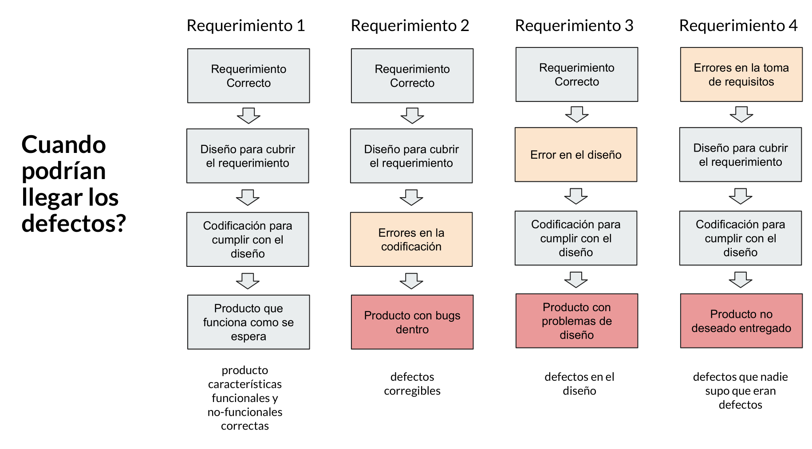
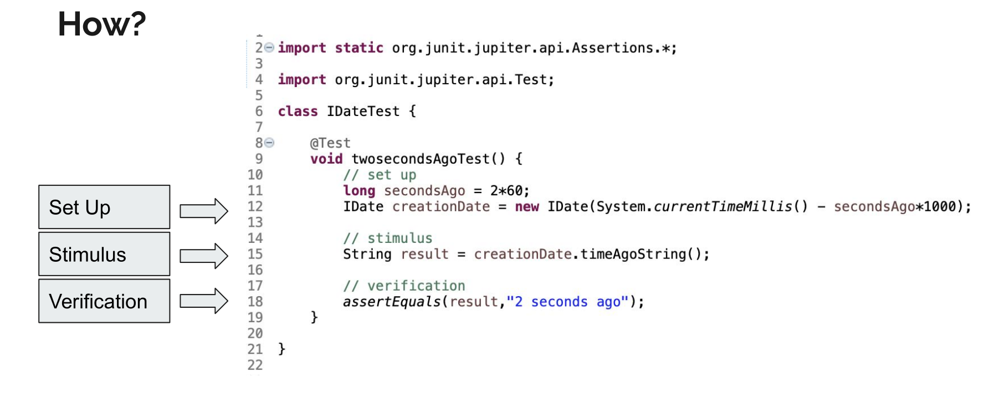

# Clase 6 de Abril

# Testing
## Fundamentos
## Prueba de conducir y Software Testing
- Planning and preparation: Tanto el examinador como el examinado necesitan un plan de acción y preparar de antemano el test, el cual no es exhaustivo, pero si es representativo y permite analizar el riesgo de las decisiones.
- Estático y dinámico: Es útil realizar tanto una evaluación dinámica (ejecución del programa - hacer conducir), como una evaluación estática (Revisión del programa - Test teorico de conducir).
- Evaluación: El examinador y el examinado debe realizar la evaluación objetivamente y reportar los resultados de la prueba.
- Satisfacción de requerimientos: Ambos analizan los resultados para ver si cumplieron los requerimientos minimos esperados.
- Detectar defectos: Ambos analizan los resultados para detectar los defectos que llevaron a las fallas.

## Conceptos básicos
### ¿Qué es Testing?
Es un proceso usado para evaluar la correctitud, completitud y la calidad de un programa de computador.

#### ¿Por qué el Software Testing es importante?
Los bugs en un software pueden ser peligrosos.

Pero... ¿en verdad los posibles errores son tan críticos? Cuento corto... ¡Si!

#### ¿Que causa los defectos?
Las personas cometemos errores. Los errores pueden venir de diferentes lugares. Ejemplo:
- Programadores: Errores en el diseño, construcción, etc
- Usuarios finales: Utilizan el software de forma *"no esperada"*

### Clasificación de errores
- Error: Acción humana que produce un resultado incorrecto
- Defecto: Presencia de una imperfección que puede ocasionar fallas.
- Falla: Comportamiento observable incorrecto con respecto a los resultados.

#### ¿Qué podria salir mal?
Varios factores que pueden llegar a defectos o fallas.
- Errores en la especificación, diseño, implementación
- Errores en el uso del sistema
- Condiciones del medio ambiente
- Daño intencional
- Otros...



### El costo de un defecto
Los defectos aumentan el tiempo de desarrollo, debido a que se debe invertir tiempo en encontrar y solucionar los bugs

## Unit testing
### What is Unit Testing?
*"Unit test are tipically automated test written and run by software developers to ensure that a section of an aplication (known as unit) meets its design and behaves as intended."*

### How?


### Why?
- We may make mistakes!
    - Early detection of problems reduces compound errors
    - Fixing a problem early is usually cheaper than fixing it later.
- We want to keep it working!
- We want to develop faster with few regressions and more confidence!

### Some Considerations
- Unit tests may not catch all posible errors
- Multiple lines of test code may need to be written to test one line of code.

## Ruby Unit Testing with RSpec
### Guia de Instalación (y de uso)
https://github.com/rspec/rspec-rails
`Gemfile`:
```ruby
group :development, :test do
    ...
    gem "rspec-rails"
```
Luego en el shell
```bash
$bundle install
$rails generate rspec:install
```
Generate a spec for a model
```bash
$rails generate model user
$rails generate rspec:model user
$rails generate --help | grep rspec
```
Implementación de RSpec
```ruby
require 'rails_helper'

RSpec.describe User, type: :model do
    context 'test hello' do # (almost) plain English
        it 'cannot have comments' do #
            user = User.new
            expect(user.sayHello).to eq('hello')
        end
    end
end
```
Output:
```
expect(target).to eq 1
expect(target).not_to eq 1
expect(5).to be < 6
expect(5).to == 5
expect(5).to be_between(1, 10)
expect(5).to be_within(0.05).of value
expect(x).to be_zero # FixNum#zero?
expect(x).to be_empty # Array#empty?
expect(x).to have_key # Hash#has_key?
expect(obj).to be_an_instance_of MyClass
expect(obj).to be_a_kind_of MyClass
expect(list).to include(<object>)
expect(list).to have(1).things
expect(list).to have_at_least(2).things
expect(list).to have_at_most(3).things
```

## Capibara: Acceptance Testing Framework


https://teamcapybara.github.io/capybara/

Primero, en el `Gemfile`

```ruby
group :test do
    gem 'capybara', '>= 3.26'
    gem 'selenium-webdriver'
    gem 'webdrivers'
end
```
Welcome Page
```ruby
RSpec.describe 'Welcome', type: :system do
    it 'index' do
        visit '/welcome'
        expect(page).to have_content('Welcome')
    end
end
```

Running Tests
```bash
$rspec
```

Sign Up
El test hace un side-effect en la base de datos. La siguiente evz que se ejecute, ya existirá el usuario.
```ruby
require 'rails_helper'

RSpec.describe 'Sign Up', type: :system do
    it 'successs' do
        visit '/users/new'
        fill_in "Username", with => "juampi"
        fill_in "Password", with => "magic"
        click_button "Create User"
        expect(page).to have_content("You are Logged In, juampi")
    end
end
```

### NOTA
El `Rakefile` es como el `Gemfile`, pero dentro del `Rakefile` se pueden colocar comandos, que por ejemplo, se los puedes entregar a la consola de GitHub para que los ejecute. 
